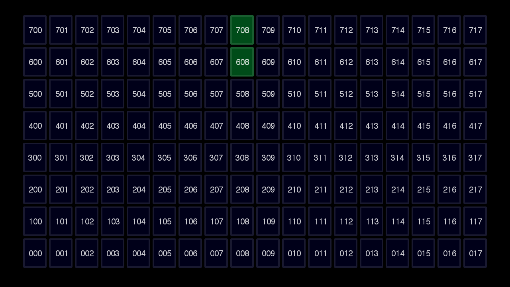
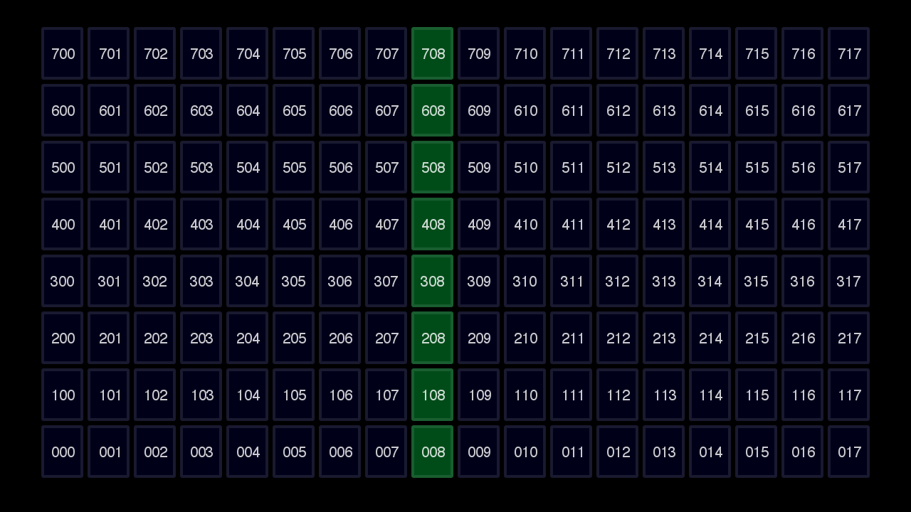

ga144tools - Python toolchain for GA144
=======================================

This package is an alternate toolchain for GA144 CPUs. The tools are all Python-based,
and the only additional requirements are 
[PySerial](http://pyserial.sourceforge.net/) and the m4 utility.

For example, [fibonacci.ga](src/fibonacci.ga) counts in the Fibonacci sequence in node 608, and transmits the integers back to the PC via the serial port on node 708.

It writes the integer sequence on the serial port:

    2
    3
    5
    8
    13
    21
    etc.
  
Another example, 
[mathdemo.ga](src/mathdemo.ga) counts up from 100, on node 008.
Nodes 108 through 608 are wire nodes; they just carry data upwards towards node 708.

To use it, connect the USB cable to USB port A on your GA144 board, and (assuming your device is at /dev/ttyUSB0) do:

    python asm.py /dev/ttyUSB0 fibonacci.ga

You should see something like this:

    ...
    bootstream is 906 words
    ---------  DOWNLOAD COMPLETE  ----------
    0x00002  2
    0x00003  3
    0x00005  5
    0x00008  8
    0x0000d  13
    0x00015  21
    
Instruction set notes:

  http://www.colorforth.com/inst.htm

  http://www.colorforth.com/arith.htm

  http://www.colorforth.com/etherCode.htm

Booting:

  http://www.forth.org/svfig/kk/11-2013-Shattuck.pdf

